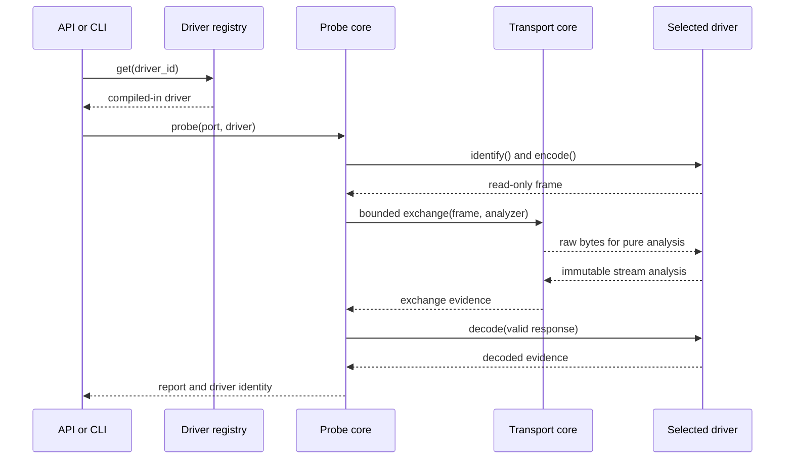

# Architecture

QSIdentify 1.0 separates radio-independent orchestration from compiled-in,
pure protocol drivers. Core code owns port discovery, bounded serial I/O,
capture serialization, command-line presentation and the public API. A driver
owns every protocol byte, message interpretation and family-specific advisory.

M1.3 adds an offline layer after sanitized bundle creation. `evidence_registry`
stores immutable canonical bundle records, pseudonymous devices, declarations,
candidates and review events. `contribution` validates deterministic ZIP files.
Neither module imports transport code, opens ports, accesses the network, or
modifies production catalogs.

```text
Public API / CLI
       |
       v
Driver registry -----> selected immutable Driver
       |                         |
       v                         v
Probe orchestration ------> allowlisted command + encoder
       |
       v
Generic transport --------> timestamped raw stream
       |
       v
Selected driver ----------> stream analysis + decoded evidence
       |
       v
Generic report/capture ---> optional driver advisory
```

```text
captures -> sanitized bundle -> contribution review -> explicit registry import
                                      |                       |
                                      v                       v
                              no implicit mutation     descriptive aggregation
                                                              |
                                                              v
                                                    manual catalog proposal
```

## Lifecycles



Transport never searches firmware strings, recognizes protocol identifiers or
knows hardware revisions. Drivers never open ports, read, write, sleep or alter
line state. Capture schema v3 records the driver identity and exact transport
evidence. Offline advisory is invoked only after capture/report construction.

The registry is constructed deterministically from package imports. There is no
filesystem scanning, entry-point discovery, network import or external plugin
execution.

M1.1 adds a release-hardening lifecycle after capture construction: offline
sanitization removes host metadata, validation replays driver analysis, fixture
manifests bind golden evidence to SHA-256, and artifact smoke tests verify the
same compiled registry and catalogs after installation.
